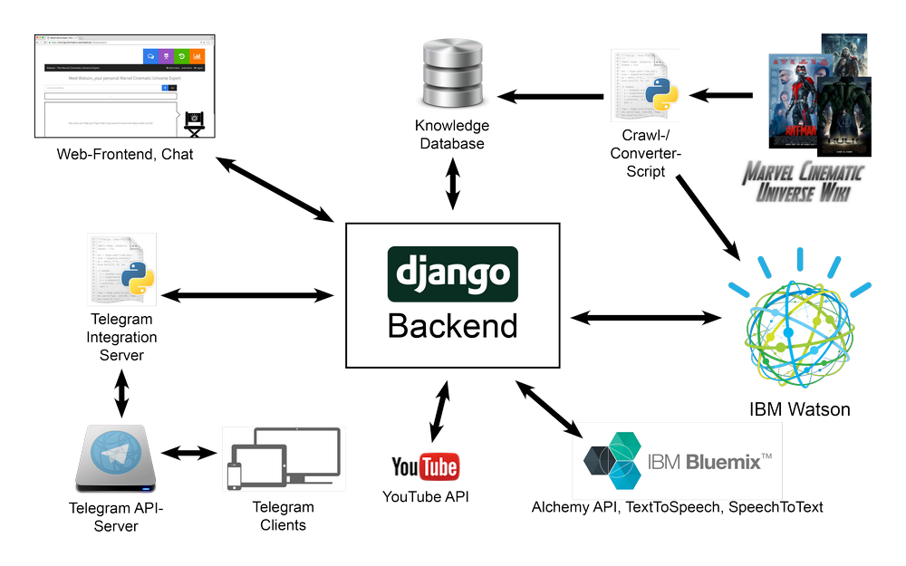

# Watson (based) Domain Expert Chatbot

A chatbot (not conversational but domain expert) based on IBM Watson Private Instance and IBM Bluemix services.

It was build in the context of the project lab *Question Answering Technologies Behind and With IBM Watson* in the summer semester 2016 at TU Darmstadt, Department of Computer Science, Language Technology Group.

The original goal of this group was to create a chatbot based on a Watson Private Instance, which would be an easy and entertaining to use subject expert. To achieve this goal a web application and an instant messenger integration server were created to offer the user the features provided by the back end.

The back end itself uses the Private Instance as well as the Alchemy API from the IBM Bluemix Services and a specially created knowledge base to provide answers to explicit questions and autonomously contribute to ongoing conversations about the domain it was trained for – currently the Marvel Cinematic Universe.

## Motivation

These days people are used to finding the information they are searching for within little more than a second. They just throw a few keywords into a search engine and instantly receive thousands if not millions of possible answers, with the best one usually on top or in the worst case in the top ten.

Those engines already perform exceptionally well when retrieving relevant pages and ranking the results. Still, most of the time, the user is not interested in reading a whole article -- even if it has the specified keyword(s) in it -- but has a precise question instead and would prefer a clear answer. To stick out a search engine needs the ability to present textual answers to simple (factoid) questions. This causes a great interest in the field of Question Answering (QA) systems.

IBM's Watson technology is known around the world and certainly performs at state-of-the-art level within its area. The great interest in this technology causes the appeal of new systems, which demonstrate its applicability and benefit.

Another area flourishing in recent years is the whole field of social media. People are networking (digitally) more than ever and most communication these days seems to be happening over e-mail or instant messaging/chat. Every individual seems to be present in several applications allowing real time chatting.

So why not unite the two areas? This would certainly hit an area of interest, and saving time (the time to close a messenger and open a search engine) seems to be everyone's top priority at the moment. And who would not love a digital know-it-all?!

As a conclusion, the goal of this project was to create a know-it-all chatbot based on IBM's Watson technology, that anyone could easily use and be entertained by. 

A web application provides flexibility and allows easy testing as well as evaluation. An API gives way to plenty of future extensions. Finally, an Integration Server for an existing Instant Messaging Service (in this case Telegram) with clients of more than half a dozen platforms allows easy access without the necessity of creating or using an additional service or application.

## Components

Our system integrates multiple Application Programming Interfaces \textit{(APIs)} and an additional knowledge base we created using a python (django) based back end. 

This back end also contains an NLP processing and answer generation pipeline. It provides API endpoints for two front end clients (a web application and an integration into the Telegram instant messenger) and can also be used by further clients. 

## Documentation

You can find more documentation, i.e. how to setup a system in the source folders of the subprojects and in the documentation folder.

## License

This project is licensed under the GNU AFFERO GENERAL PUBLIC LICENSE Version 3. See [LICENSE](LICENSE) for more information.